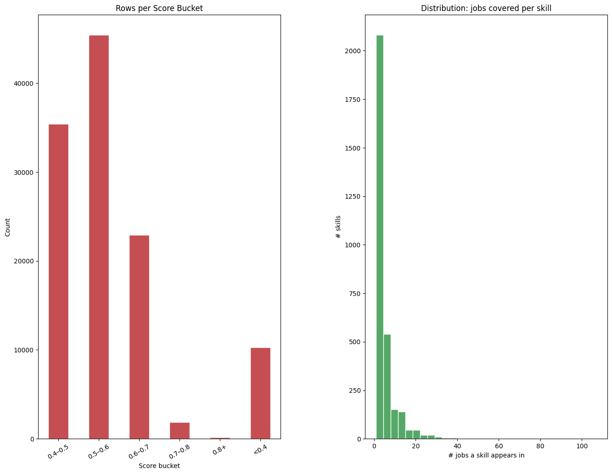
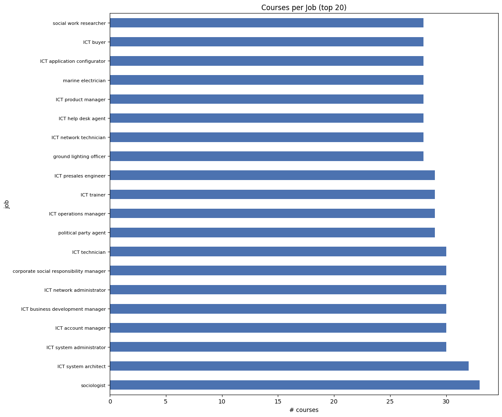

# Job–Course Mapping Pipeline: Results Summary

## Overview

This report summarises the results of a two-stage pipeline that maps online courses to jobs via ESCO-aligned skills. The pipeline was developed to support personalised course recommendations for professional growth.

---

## Stage 1: Skill Enrichment with ESCO Taxonomy

Skills extracted from course metadata were aligned to the ESCO skills taxonomy using semantic similarity with the `all-mpnet-base-v2` sentence embedding model.

- **Your skills:** 15,037
- **ESCO skills:** 13,960
- **Method:** Cosine similarity via `emb_your_skills @ emb_esco.T`

### Threshold Selection

| Threshold | Matched | Unmatched | Match % |
| --------- | ------- | --------- | ------- |
| 0.30      | 15,037  | 0         | 100.0%  |
| 0.40      | 15,030  | 7         | 100.0%  |
| 0.45      | 14,991  | 46        | 99.7%   |
| 0.50      | 14,725  | 312       | 97.9%   |
| 0.55      | 13,659  | 1,378     | 90.8%   |
| 0.60      | 10,826  | 4,211     | 72.0%   |

**Chosen threshold: 0.45** → 14,991/15,037 matched (99.7%)

The 46 unmatched skills had very specific descriptions that could not be aligned to any ESCO entry. As future work, these could be generalised using an LLM before re-attempting the match.

Each matched skill was enriched with a `SkillUri` and an `esco_uri`, saved to an enriched CSV.

---

## Stage 2: Job–Course Mapping

Jobs were matched to course skills using the `paraphrase-multilingual-MiniLM-L12-v2` model, chosen for its multilingual support given the mixed-language course catalogue.

- **Skills:** 15,037
- **Courses:** 10,756
- **Jobs:** 2,986

### Threshold Selection

A lower threshold of **0.35** was chosen deliberately — for highly specific jobs, even a loose skill overlap can justify a course recommendation.

| Threshold | Avg skills/job | Jobs with 0 skills |
| --------- | -------------- | ------------------ |
| 0.30      | 734.0          | 2                  |
| 0.35      | 338.6          | 17                 |
| 0.40      | 145.1          | 69                 |
| 0.45      | 59.1           | 194                |
| 0.50      | 22.9           | 477                |

**Jobs with at least 1 skill matched: 2,969 / 2,986**

### Jobs with No Match (17)

A small set of highly specialised or niche jobs could not be matched at the chosen threshold. Examples: _cigar inspector, cocoa press operator, domestic butler, extra, farrier_. These could be addressed by lowering the threshold selectively or enriching their job descriptions.

---

## Final Results

| Metric                 | Value   |
| ---------------------- | ------- |
| Total job–course pairs | 116,110 |
| Unique jobs covered    | 2,969   |
| Unique courses used    | 1,477   |
| Unique bridge skills   | 3,079   |
| SkillUri coverage      | 100.0%  |
| esco_uri coverage      | 99.7%   |

### Courses per Job

| Stat            | Value |
| --------------- | ----- |
| Mean            | 39.1  |
| Median          | 34.0  |
| Std             | 26.4  |
| Min             | 1     |
| Max             | 205   |
| 25th percentile | 24    |
| 75th percentile | 46    |

---

## Visualisations

### Score Distribution & Skill Coverage

**Rows per Score Bucket (left):** Most pairs land in the 0.4–0.6 range, with 0.5–0.6 being the most common (~45,000 pairs). Scores above 0.7 are rare — job titles and course descriptions don't tend to share much vocabulary, so high similarity is hard to achieve. The ~10,000 pairs below 0.4 are there by design, to avoid leaving niche jobs with no recommendations at all.

**Distribution: jobs covered per skill (right):** Most skills are quite specific — they bridge only 1–5 jobs. A handful of broader skills cover 20+ jobs, but they're the exception. The long tail makes sense given how the ESCO taxonomy is structured, and it's a good sign that the course catalogue isn't just recycling the same few general topics.

---

### Courses per Job (Top 20)

The top 20 jobs by matched courses are mostly **ICT roles**, which reflects how technology-heavy the course catalogue is. **Sociologist** and **ICT system architect** top the list at ~32–33 courses each. The range is pretty narrow across the top 20 (28–33), so there's no single job that's dramatically better served than others. It's also worth noting that non-ICT jobs like _social work researcher_, _political party agent_, and _corporate social responsibility manager_ make the list — likely because soft-skill and management courses cover a wide enough range to match them too.

---

## Key Observations

- The pipeline achieves near-complete ESCO alignment (99.7%) and job coverage (99.4%), validating the chosen thresholds.
- The average job is linked to ~39 courses via ~339 skill matches, providing rich recommendation diversity.
- The small set of unmatched jobs and skills represents edge cases with highly domain-specific language, addressable with LLM-based description generalisation as future work.
- All job–course links are traceable through a named bridge skill with a corresponding ESCO URI, enabling explainable recommendations.
